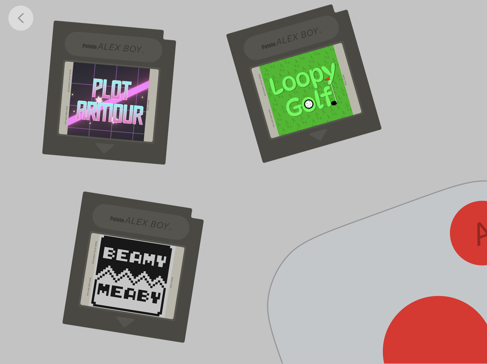
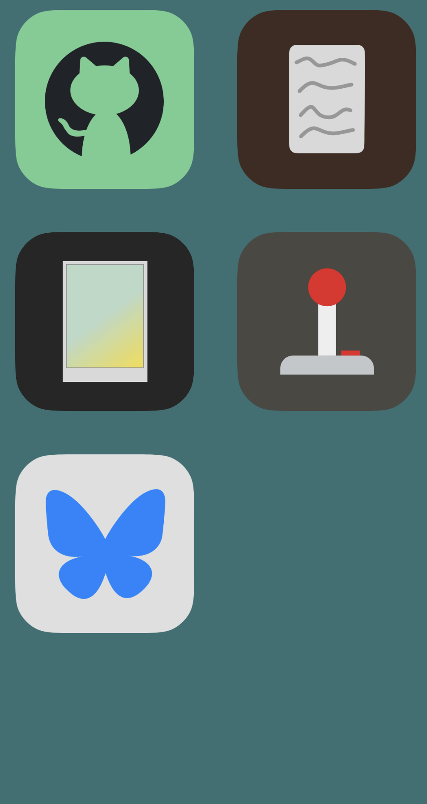
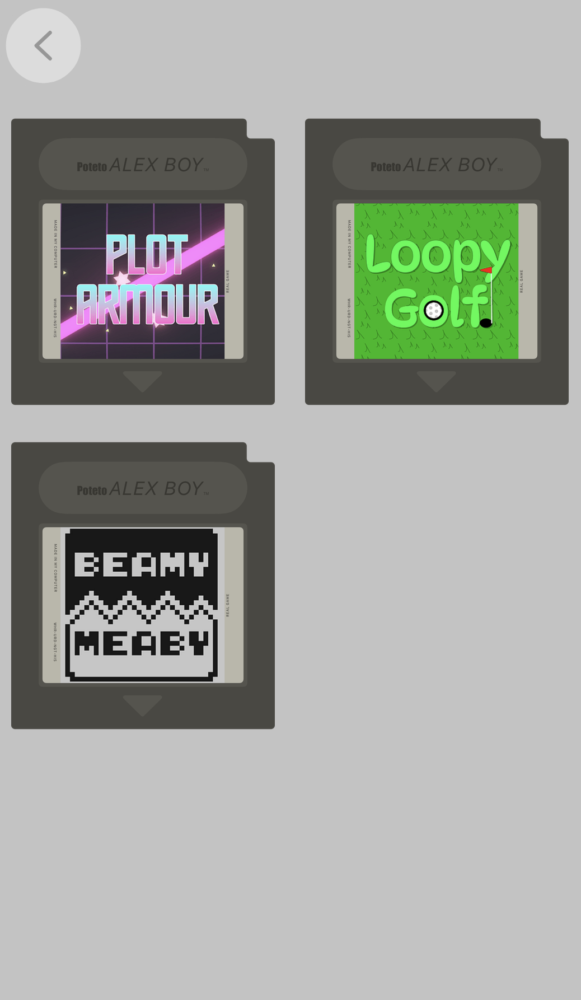

# Alex's Desk
My personal website built with pure HTML and CSS. All assets created by myself!

Check it out:
***https://thealonealex.dev***
## Features
- An interactable visual experience
- A bunch of awesome photos
- A hub with my games
- A link to my blog
- Social & github redirects
- Rich embeds in social media sites, like Discord
## Mobile and desktop versions
While developing the website it became clear that the design I had in mind wouldn't work for mobile as well, so each of the pages of the website has two divs that dynamically appear and dissapear depending on your display resolution. That way, the website appears fittingly no matter what device you use to view it
### Desktop
- The main page features a recreation of my real desk. You can hover over objects and interact with them, and they play little animations when you do!
- All the pages are built to always fit all the content in the page and use a 4/3 ratio no matter what ratio your viewport has

Homepage|Photos page|Games page
:----------:|:--------:|:--------:
||
### Mobile
- The main page is styled to ressemble a smartphone, with a all the interactable objects from the desktop version turned into app icons
- All the pages are adapted to fit better on the aspect ratio most phones use. Depending on your web browser's viewport some content might be scrollable

Homepage|Photos page|Games page
:----------:|:--------:|:--------:
||
## Tests
- The desktop website has been tested on Helium (Chromium) and Safari (Webkit) and Zen/Firefox (Gecko) on various aspect ratios
- The mobile website has been tested on Chrome (Chromium) and Firefox (Gecko)
## Credits
- This [stardance guide](https://stardance.hackclub.com/missions/personal-page/guide) for a quick intro to making a website :)
- A lot of code from [StackOverflow](https://stackoverflow.com/)

Shield: [![CC BY-NC-SA 4.0][cc-by-nc-sa-shield]][cc-by-nc-sa]

This work is licensed under a
[Creative Commons Attribution-NonCommercial-ShareAlike 4.0 International License][cc-by-nc-sa].

[![CC BY-NC-SA 4.0][cc-by-nc-sa-image]][cc-by-nc-sa]

[cc-by-nc-sa]: http://creativecommons.org/licenses/by-nc-sa/4.0/
[cc-by-nc-sa-image]: https://licensebuttons.net/l/by-nc-sa/4.0/88x31.png
[cc-by-nc-sa-shield]: https://img.shields.io/badge/License-CC%20BY--NC--SA%204.0-lightgrey.svg
